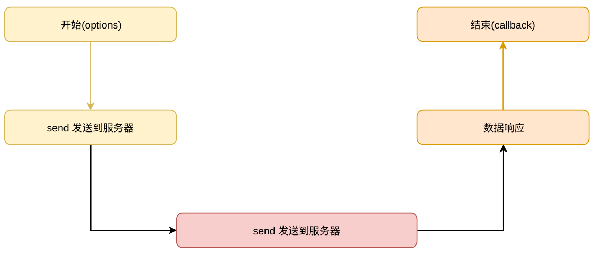
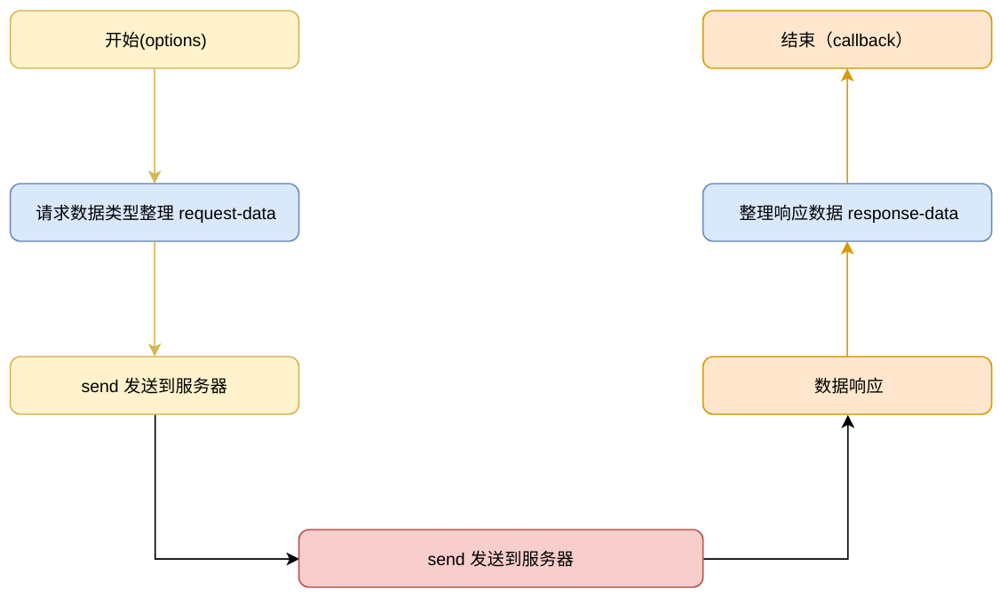

# 关于 Ajax 框架实现的知识点

## Ajax 是什么

-   AJAX 全称为“Asynchronous JavaScript and XML”（异步 JavaScript 和 XML），是一种创建交互式网页应用的网页开发技术；
-   Ajax 不是一种新的编程语言，而是一种用于创建更好更快以及交互性更强的 Web 应用程序的技术；
-   Ajax 在当前前端开发中成为必备的技能。

## 最常用的 Ajax 开发库

-   axios 易用、简洁且高效的 http 库； [http://www.axios-js.com](http://www.axios-js.com)
-   Fetch API 是 XMLHttpRequest 的现代替代方法，用于从服务器检索资源； [https://www.w3cschool.cn/fetch_api/](https://www.w3cschool.cn/fetch_api/)
-   jQuery 曾经是 JavaScript 中比较有名的一个前端库，用于处理从 AJAX 调用到操纵 DOM 内容的所有事情。尽管其他相关前端库的相关性有所降低，但仍然可以使用 jQuery 来进行异步调用。[https://api.jquery.com/category/ajax/](https://api.jquery.com/category/ajax/)

## 三种实现 Ajax 的技术方案

-   [XMLHTTPRequest](https://developer.mozilla.org/zh-CN/docs/Web/API/XMLHttpRequest)、[XMLHTTP](https://developer.mozilla.org/zh-CN/docs/Web/API/XMLHttpRequest/Using_XMLHttpRequest_in_IE6) 是一组 API 函数集；
-   [fetch](https://developer.mozilla.org/zh-CN/docs/Web/API/Fetch_API/Using_Fetch) 最新浏览器原生支持的，通过 Promise 方案来实现；
-   动态加载 JS 的方案来实现的 [JSONP](https://blog.csdn.net/hansexploration/article/details/80314948) 技术。

## fetch 和 XMLHttpRequest 常用功能对比

| 内容        | fetch                           | XMLHttpRequest                   |
| ----------- | ------------------------------- | -------------------------------- |
| 创建方式    | 函数 window.fetch(options)      | 对象 new XMLHttpRequest()        |
| 同步&异步   | 不支持同步，天生异步（Promise） | 支持同步&异步                    |
| 跨域        | 支持跨域，设置内容更多          | 支持跨域                         |
| cookie      | 支持                            | 支持                             |
| 跨域 cookie | 支持设置                        | 支持设置                         |
| header      | 允许通过 new Headers()          | xhr.setRequestHeader(key, value) |
| 请求体      | 允许通过 new Request()          | 通过 xhr 参数设置                |
| 响应方式    | Promise                         | 事件回调                         |
| 文件上传    | 支持，但是不支持上传进度        | 完全支持                         |
| 请求超时    | 不支持，需要自己实现            | 完全支持                         |

## fetch 和 XMLHttpRequest 中响应体数据类型支持

| fetch                                              | XMLHttpRequest                                                             |
| -------------------------------------------------- | -------------------------------------------------------------------------- |
| response.arrayBuffer()                             | xhr.responseType = 'arrayBuffer'                                           |
| response.blob()                                    | xhr.responseType = 'blob'                                                  |
| response.formData()                                | 不支持                                                                     |
| response.json()                                    | xhr.responseType = "json"，支持有限，建议使用 JSON.parse(xhr.responseText) |
| response.text()                                    | xhr.responseType = "text"                                                  |
| 不支持，可以通过 response.text()后，通过字符串转换 | xhr.responseType = "document"(xml)                                         |

## 最简单的 Ajax 请求流程



1.  调用 Ajax 函数，将请求数据（options）传入 ajax；
2.  通过 XMLHTTPRequest、XMLHTTP、fetch 或者 JSONP 封装后，调用 send 发送；
3.  数据通过网络传入服务器，等待数据接收完成；
4.  触发 onload，接收服务器断的响应数据；
5.  触发 options 传入的 callback 函数，完成 Ajax 调用过程。

## Ajax 的两个阶段

1.  以网络传输作为分界点；
2.  前面的称为请求阶段（Request）;
3.  后面的称为响应阶段（Response）。

## Ajax 的数据处理能力

-   **querystring** URL 查询字符串(通常用于 Ajax 请求数据参数)[https://baijiahao.baidu.com/s?id=1619273328999923463&wfr=spider&for=pc](https://baijiahao.baidu.com/s?id=1619273328999923463&wfr=spider&for=pc);
-   **[JSON](http://www.json.org)** JS 中最基础的数据格式,通常用于数据获取[http://www.json.org](http://www.json.org);
-   **[XML](https://www.w3school.com.cn/xml/xml_intro.asp)** 在没有 JSON 数据格式化的时候，最流行的一种数据格式，现在基本不用；
-   **[FormData](https://developer.mozilla.org/zh-CN/docs/Web/API/FormData/Using_FormData_Objects)** 用于模拟表单数据，通常用户上传文件时使用；
-   **其他的数据类型支持** 不是很常用,请参照[https://developer.mozilla.org/zh-CN/docs/Web/API/Fetch_API/Using_Fetch#Body](https://developer.mozilla.org/zh-CN/docs/Web/API/Fetch_API/Using_Fetch#Body)。

## 加入数据类型的 Ajax 请求流程图



## 关于 [header](https://blog.csdn.net/m0_37730732/article/details/82263609)

-   请求头(Request Headers)；
-   响应头(Response Headers)；
-   HTTP 消息头支持自定义， 自定义的专用消息头一般会添加'X-'前缀；

## header 与数据类型关系

-   不同数据类型，需要有不同的请求头来描述。

## Ajax 框架高阶封装

-   拦截器；
-   事件模型；
-   短路径；
-   分组模型。

### 拦截器

-   axios 中首先使用，目的是讲重复的 ajax 代码统一处理；

### 事件模型

-   参照 nodejs 中的 [EventEmitter](http://nodejs.cn/api/events.html#events_class_eventemitter)
-   事件比拦截器灵活性更强

### 短路径

-   url 中自定义的一种目录规则；
-   方便表达语义化规则；
-   方便对一组接口进行目录迁移。

### 分组模型（三层）

-   对具有某些相同属性的 ajax 接口进行分组；
-   方便统一设置全局参数；
-   分别设置分组的拦截器。


## 加入高阶特性的流程图


> Ajax 框架库源码 [request-h5](https://github.com/szpoppy/request-h5)

## 使用代码展示 - 公共封装

```js
// request.js
import requestH5 from "request-h5";

//　常用的ajax请求分组
export let ajax = new requestH5.Request();

//　默认参数设置
ajax.setConf({
    // 放弃fetch API的使用
    useFetch: false,
    // 请求数据类型
    dataType: "json",
    paths: {
        //短路经　webapi:
        webapi: "/api/function/"
    }
});

// request拦截器
ajax.on("open", function(req) {
    // 获取当前参数
    let param = req.param;
    if (param && !param.userId) {
        // 加入默认参数
        param.userId = "保持在本地的用户id";
    }
});

// response 拦截器
ajax.on("verify", function(res) {
    // 获取当前参数
    let result = res.json || {};
    let msg = result.msg || "";
    let code = result.code || "";

    if (code == "0") {
        // 说明数据请求是成功的
        res.err = null;
        return;
    }

    // 错误异常
    res.err = {
        code: code,
        msg: msg || "未知错误，请稍后再试..."
    };
});

//　graphql分组
export let graphql = new requestH5.Request();

//　默认参数设置
graphql.setConf({
    // 请求数据类型 querystring 类型
    dataType: "querystring",
    paths: {
        //短路经　webapi:
        webapi: "/api/graphql/"
    }
});
// request拦截器
graphql.on("open", function(req) {
    // 通用的参数
    let common = {
        userId: "保持在本地的用户id";
    }
    // 获取当前参数
    let param = req.param || {};
    req.param = {
        gql: parm.gql || "",
        para: JSON.stringify(param.para || {}),
        common: JSON.stringify(common)
    }
});

// response 拦截器
graphql.on("verify", function(res) {
    // 获取当前参数
    let result = res.json || {};
    let msg = result.msg || "";
    let falg = result.falg || "";

    if (falg) {
        // 说明数据请求是成功的
        res.err = null;
        return;
    }

    // 错误异常
    res.err = {
        falg: falg,
        msg: msg || "未知错误，请稍后再试..."
    };
});

// 简单的运行函数
function graphqlExec (isMutation, gqlStr, para) {
    // url
    let url = isMutation && "webapi:mutation" || "webapi:query";
    // 方法
    let method = isMutation && "POST" || "GET";
    // 返回promise方案
    return gql.fetch({
        url,
        method,
        param: {
            gql: gqlStr,
            para: para
        }
    })
}

// query 查询
graphql.query = function(gqlStr, para){
    return graphqlExec(false, gqlStr, para);
}
// mutation 变更
graphql.mutation = function(gqlStr, para){
    return graphqlExec(true, gqlStr, para);
}
```

### 实际项目代码中使用

```js
import { ajax, graphql } from "request.js";

// 请求一个接口
ajax.get(
    // 实际url会替换为 /api/function/query
    // 默认也会将 userId 放到参数中
    "webapi:query",
    function(res) {
        // res 返回response
        if (res.err) {
            // 这里发生了异常
            // ...
            return;
        }

        // 下面为正常处理
        // ...
    },
    {
        para1: "1",
        para2: "2"
    }
);

// gql 查询获取用户信息
graphql.query("query{userInfo{userId, nickName}}");

// gql 变更用户昵称
graphql.mutation("mutation($nick:String){userNick(nick:$nick){isSuccess}}", { nick: "这是昵称" });
```
